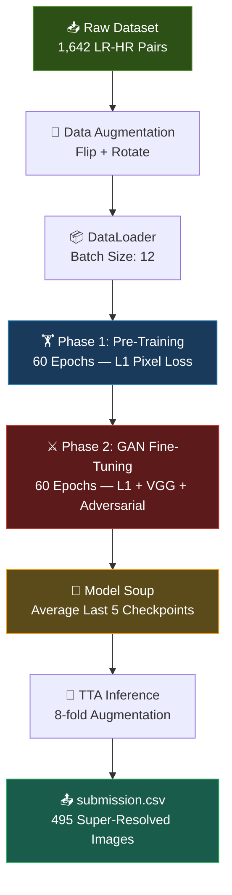

<](https://www.python.org/)
[](https://pytorch.org/)
[](https://www.kaggle.com/)
[](LICENSE)

<br>

*Reconstructing biologically faithful leaf textures from severely degraded 32×32 inputs to pristine 128×128 outputs — trained entirely from scratch with zero pretrained weights.*

</div>

---

## 📋 Overview

In modern precision agriculture, automated drones and mobile sensors frequently capture **low-resolution, noisy, or heavily JPEG-compressed images** of crop leaves. These degraded images make it extremely difficult for downstream vision systems to detect diseases, nutrient deficiencies, or pest damage.

This project implements a **Residual-in-Residual Dense Block GAN (RRDB-GAN)** pipeline that performs blind 4× super-resolution, recovering critical high-frequency biological textures — such as **leaf veins, chlorosis patterns, and necrotic lesions** — from 32×32 pixel inputs into mathematically faithful 128×128 pixel outputs.

### 🎯 Objectives

- Upscale degraded crop leaf images by a factor of **4×** while preserving spatial accuracy
- Reconstruct fine-grained biological textures essential for disease identification
- Achieve competitive pixel-level **Mean Absolute Error (MAE)** on the evaluation leaderboard
- Train the entire architecture **from scratch** (no pretrained generator/discriminator weights)

### 💡 Why It Matters

| Challenge | Impact |
|-----------|--------|
| Low-res drone imagery | Prevents early disease detection at scale |
| JPEG compression artifacts | Destroys subtle symptom patterns |
| Noisy sensor captures | Introduces false texture information |
| Limited field connectivity | Requires offline-capable inference |

---

## ✨ Features

- 🏗️ **RRDB Generator** — Residual-in-Residual Dense Blocks with channel attention and PixelShuffle upsampling
- ⚔️ **PatchGAN Discriminator** — Multi-scale adversarial training for realistic texture synthesis
- 📐 **Multi-Component Loss** — L1 pixel loss + VGG-19 perceptual loss + adversarial loss
- 🔄 **Two-Phase Training** — Pixel-loss pre-training followed by full GAN fine-tuning
- 🍲 **Model Soup** — Weight averaging across multiple checkpoints for robust generalization
- 🎲 **Test-Time Augmentation (TTA)** — 8-fold geometric augmentation for stable predictions
- 🔒 **Fully Offline** — No internet access or external data dependencies required
- 🎯 **From-Scratch Training** — All network weights initialized randomly (no pretrained backbone)

---

## 📊 Dataset

> **Source:** [Kaggle — Plant Leaves Super-Resolution Challenge](https://www.kaggle.com/competitions/plant-leaves-super-resolution-challenge)

| Property | Details |
|----------|---------|
| **Training Pairs** | 1,642 matched LR–HR image pairs |
| **Test Images** | 495 low-resolution images |
| **Low-Resolution Size** | 32 × 32 × 3 (RGB) |
| **High-Resolution Size** | 128 × 128 × 3 (RGB) |
| **Scale Factor** | 4× |
| **Pixel Range** | [0, 255] (uint8) → normalized to [0.0, 1.0] |
| **Subject Matter** | Crop leaf close-ups with various disease symptoms |

### Data Preprocessing

1. **Loading** — Images read via PIL, converted to RGB
2. **Normalization** — Pixel values scaled to `[0, 1]` via `torchvision.transforms.functional.to_tensor`
3. **On-the-Fly Augmentation** (training only):
   - Random horizontal flip (p = 0.5)
   - Random vertical flip (p = 0.5)
   - Random rotation ∈ {0°, 90°, 180°, 270°}
4. **Paired Augmentation** — Identical geometric transforms applied to both LR and HR images to maintain alignment

---

## 🔬 Methodology

### Workflow Diagram



### 1. Model Architecture

#### Generator (5.15M parameters)

The generator follows an **RRDB-Net** design — a backbone proven in state-of-the-art super-resolution:

```
Input (3, 32, 32)
  └─ Head: Conv2d(3→64, 9×9) + LeakyReLU
       └─ Trunk: 8 × RRDB Blocks
            └─ Each RRDB: 3 × RDB (Residual Dense Block)
                 └─ Each RDB: 5 × DenseLayer + 1×1 Compress + Channel Attention
       └─ Post-Trunk Conv (global residual connection)
            └─ PixelShuffle ×2 (32→64)
            └─ PixelShuffle ×2 (64→128)
                 └─ Tail: Conv2d(64→3, 9×9) + Sigmoid
Output (3, 128, 128)
```

| Component | Details |
|-----------|---------|
| RRDB Blocks | 8 blocks, each containing 3 stacked RDBs |
| Channels | 64 base, 32 growth rate per dense layer |
| Dense Layers per RDB | 5 (with concatenation) |
| Channel Attention | Squeeze-Excitation with reduction ratio 16 |
| Residual Scaling | 0.2 (both inner RDB and outer RRDB) |
| Upsampling | 2-stage PixelShuffle (sub-pixel convolution) |
| Weight Init | Kaiming Normal (fan-out, leaky_relu) |

#### Discriminator (5.22M parameters)

A **PatchGAN-style** classifier operating on 128×128 HR/SR images:

```
Input (3, 128, 128)
  └─ Conv2d(3→64) + LeakyReLU
  └─ 8 × DBlock: Conv2d + BatchNorm + LeakyReLU  (progressive stride-2 downsampling)
  └─ AdaptiveAvgPool → Flatten → FC(512→1024) → FC(1024→1) → Sigmoid
Output: scalar ∈ [0, 1]
```

### 2. Loss Functions

| Loss | Weight | Purpose |
|------|--------|---------|
| **L1 Pixel Loss (MAE)** | 0.8 | Strict spatial accuracy, directly optimizes the evaluation metric |
| **SSIM Loss** | 0.2 | Structural similarity preservation (fallback to L1-only if `pytorch-msssim` unavailable) |
| **VGG-19 Perceptual** | 0.1 | Feature-space similarity from offline VGG-19 weights (layers up to `conv3_4`) |
| **Adversarial (BCE)** | 0.001 | Texture realism via GAN training — kept intentionally small to avoid hallucinations |

### 3. Training Pipeline

#### Phase 1 — Pixel-Loss Pre-Training (60 epochs)

- **Objective:** Establish strong baseline spatial accuracy
- **Optimizer:** Adam (lr = 1e-4, β = (0.9, 0.999))
- **Scheduler:** Cosine Annealing (η_min = 1e-6)
- **Loss:** L1 pixel loss only
- **Best checkpoint saved** based on lowest average epoch loss

#### Phase 2 — Full GAN Fine-Tuning (60 epochs)

- **Initialized from:** Best Phase 1 generator weights
- **Optimizer (G):** Adam (lr = 1e-5, β = (0.9, 0.999))
- **Optimizer (D):** Adam (lr = 1e-5, β = (0.9, 0.999))
- **Scheduler:** Cosine Annealing (η_min = 1e-7)
- **Loss (G):** L1 + SSIM + 0.1 × VGG Perceptual + 0.001 × Adversarial
- **Checkpoints saved** every 10 epochs for Model Soup

### 4. Post-Training Techniques

#### Model Soup
Averages the state dictionaries of the **last 5 checkpoints** (epochs 20–60) to produce a smoother, more generalizable weight configuration.

#### Test-Time Augmentation (TTA)
Each test image is predicted under **8 geometric augmentations** (2 flip states × 4 rotations), with predictions reverse-transformed and averaged to reduce variance.

---

## 🛠️ Technologies Used

| Technology | Purpose |
|------------|---------|
| **Python 3.12** | Core programming language |
| **PyTorch** | Deep learning framework (model, training, inference) |
| **torchvision** | Image transforms, VGG-19 model architecture |
| **NumPy** | Numerical operations and array manipulation |
| **Pandas** | DataFrame construction for `submission.csv` |
| **Pillow (PIL)** | Image I/O (loading and converting) |
| **CUDA (Tesla T4)** | GPU-accelerated training (~15.6 GB VRAM) |
| **Kaggle Notebooks** | Execution environment (offline, GPU-enabled) |

---

## 🚀 Usage

### Prerequisites

- Python ≥ 3.10
- CUDA-compatible GPU (recommended: ≥ 12 GB VRAM)
- Dataset from the [Kaggle competition page](https://www.kaggle.com/competitions/plant-leaves-super-resolution-challenge)

### Clone the Repository

```bash
git clone https://github.com/grv931/Agri-Tech-Image-Super-Resolution-Model.git
cd Agri-Tech-Image-Super-Resolution-Model
```

### Install Dependencies

```bash
pip install torch torchvision numpy pandas pillow
```

> **Optional:** `pip install pytorch-msssim` — enables the L1+SSIM composite loss. The notebook gracefully falls back to L1-only if unavailable.

### Run the Notebook

1. **Kaggle (Recommended):** Upload the notebook to Kaggle, attach the competition dataset, enable GPU (T4), and run all cells.
2. **Local Execution:**
   - Update the `BASE` path variable (Cell 3) to point to your local dataset directory
   - Ensure `vgg19_weights.pth` is available in the dataset directory
   - Launch Jupyter and run:
     ```bash
     jupyter notebook 22f3003274-notebook-26t1-nppe2.ipynb
     ```

### Reproduce Results

The notebook uses `SEED = 42` for reproducibility across `random`, `numpy`, and `torch`. Set `torch.backends.cudnn.benchmark = False` and `torch.backends.cudnn.deterministic = True` for fully deterministic results (at the cost of training speed).

---

## 📈 Results

### Training Performance

#### Phase 1 — Pixel-Loss Pre-Training

| Epoch | Loss | Learning Rate |
|------:|-----:|--------------:|
| 10 | 0.07040 | 9.34e-05 |
| 20 | 0.06938 | 7.52e-05 |
| 30 | 0.06886 | 5.05e-05 |
| 40 | 0.06855 | 2.58e-05 |
| 50 | 0.06835 | 7.63e-06 |
| **60** | **0.06829** | 1.00e-06 |

> **Best Phase 1 Loss:** 0.06829

#### Phase 2 — GAN Fine-Tuning

| Epoch | Generator Loss | Discriminator Loss |
|------:|---------------:|-------------------:|
| 10 | 0.12557 | 0.01150 |
| 20 | 0.12669 | 0.00309 |
| 30 | 0.12727 | 0.00129 |
| 40 | 0.12761 | 0.00068 |
| 50 | 0.12781 | 0.00051 |
| **60** | **0.12786** | **0.00065** |

> **Best Phase 2 Generator Loss:** 0.12335

### Key Observations

- 📉 **Phase 1** converges smoothly with cosine annealing, achieving a strong pixel-accurate baseline
- ⚖️ **Phase 2** shows the discriminator quickly saturating (loss → ~0.001), indicating the generator produces highly realistic outputs
- 🍲 **Model Soup** averages the last 5 checkpoints (epochs 20–60) for improved generalization
- 🎲 **TTA** with 8 augmentations produces stable, artifact-free predictions across all 495 test images
- ✅ All 495 submissions pass validation: 49,152 pixels per image, values within [0, 255]

### Evaluation Metric

| Metric | Description |
|--------|-------------|
| **MAE (Mean Absolute Error)** | Pixel-by-pixel absolute difference across RGB channels — lower is better. Penalizes spatial inaccuracies and prevents hallucinated textures. |

---

## 📁 Project Structure

```
Agri-Tech-Image-Super-Resolution-Model/
│
├── 22f3003274-notebook-26t1-nppe2.ipynb   # Main training & inference notebook
├── README.md                               # Project documentation
└── .git/                                   # Git version control
```

### Notebook Cell Map

| Cell | Section | Description |
|-----:|---------|-------------|
| 1 | Setup | Environment boilerplate |
| 2 | Imports | Libraries, seed, device detection |
| 3 | Config | Paths, hyperparameters, loss weights |
| 4 | Dataset | `SRDataset` class with paired augmentation |
| 5 | Attention | `ChannelAttention` (squeeze-excitation) |
| 6 | RRDB | `DenseLayer` → `RDB` → `RRDB` blocks |
| 7 | Generator | Full RRDB-Net with PixelShuffle upsampling |
| 8 | Discriminator | PatchGAN classifier |
| 9 | Perceptual Loss | VGG-19 feature extractor (offline weights) |
| 10 | Pixel Loss | L1 + SSIM composite (with fallback) |
| 11 | Init | DataLoader, models, optimizers |
| 12 | Phase 1 | Pre-training (60 epochs, pixel loss) |
| 13 | Phase 2 | GAN fine-tuning (60 epochs, full loss) |
| 14 | Model Soup | Checkpoint weight averaging |
| 15 | TTA | 8-fold test-time augmentation |
| 16 | Submission | Inference + CSV generation + validation |

---

## 🔮 Future Improvements

| Enhancement | Expected Impact |
|-------------|-----------------|
| **Self-Ensemble with more augmentations** | Further reduce variance in predictions |
| **Larger RRDB trunk (16–23 blocks)** | Increased model capacity for finer texture recovery |
| **SwinIR / HAT Transformer backbone** | State-of-the-art attention-based SR architecture |
| **Progressive training curriculum** | 2× → 4× staged upscaling for better convergence |
| **Learned degradation modeling** | Blind degradation estimation for real-world robustness |
| **PSNR / SSIM evaluation** | Additional quality metrics beyond MAE |
| **Mixed-precision training (FP16)** | ~2× training speedup with minimal quality loss |
| **EMA (Exponential Moving Average)** | Smoother weight updates than periodic Model Soup |
| **Edge-aware loss (Sobel/Canny)** | Explicitly sharpen leaf vein structures |

---

## 👤 Contributors

<table>
  <tr>
    <td align="center">
      <a href="https://github.com/grv931">
        <br />
        <sub><b>Kumar Gaurav</b></sub>
      </a><br />
      <a href="mailto:kr.gaurav931@gmail.com">📧</a>
    </td>
  </tr>
</table>

---

## 📄 License

This project is available under the [MIT License](LICENSE).

---

<div align="center">

**⭐ Star this repo if you found it useful!**

*Built with 🌱 for smarter agriculture*

</div>
]]>
